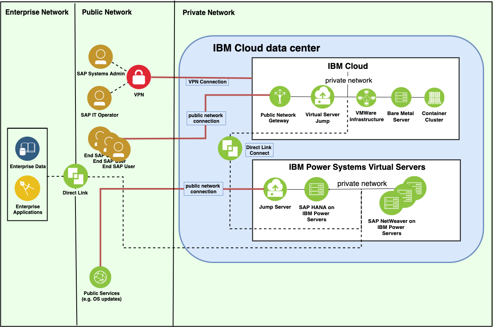

---

copyright:
  years: 2020
lastupdated: "2020-07-17"

keywords: SAP HANA, {{site.data.keyword.cloud_notm}}, network connectivity, VLANs, hybrid, STMS, SAProuter, SAP Solution Manager, SAP certified, database

subcollection: sap-hana-power

---

{:shortdesc: .shortdesc}
{:codeblock: .codeblock}
{:screen: .screen}
{:external: target="_blank" .external}
{:pre: .pre}
{:table: .aria-labeledby="caption"}

# Items to consider when you plan your SAP landscape
{: #considerations}

The SAP systems in a landscape have specific requirements for servers, operating systems, network setup, and supported storage.
{: shortdesc}

## Data centers
{: #data-center-considerations}

Currently, the SAP NetWeaver on {{site.data.keyword.IBM}} {{site.data.keyword.powerSysShort}} services and instances are available in Washington, D.C., Dallas, London, and Frankfurt. The number of supported locations is planned to be extended.

## Power Systems Virtual Server
{: #power-systems-virtual-server}

Currently, Power System E980 is supported for SAP HANA. 

## Operating systems
{: #os-considerations}

For the Linux® versions to deploy for SAP HANA, see [SAP Note 2855850](https://launchpad.support.sap.com/#/notes/2855850){: external}. An SAP S-user ID is required to access the SAP Note. Licensing for Linux is covered by client's "bring your own license" model.

## Network connectivity
{: #network_connectivity}

### Terminology
{: #network_connectivity_terminology}

Depending on your selected network option, you will need one or more of the following network types.

#### Private network
{: #network_connectivity_private}

A private network is required for the connection of your virtual instances with systems outside of the {{site.data.keyword.IBM_notm}} data centers and for communication between multiple instances in an SAP three-tier system. This is an internal network that can be used to connect individual {{site.data.keyword.powerSys_notm}}s with each other.

#### Public network
{: #network_connectivity_public}

A public network is the quickest and easiest way to connect to a {{site.data.keyword.powerSys_notm}} instance. The public network is protected by a firewall and supports the following security network protocols:
  * SSH
  * HTTPS
  * Ping
  * IBM i 5250 terminal emulation with SSL (port 992)

Other ports are blocked and can be routed through SSH. For security reasons, using a public network for SAP is not supported. Public networks can be used for other purposes (for example, for OS updates) on the virtual instances where SAP software will be installed.

#### IBM Cloud Direct Link
{: #network_connectivity_direct_link}

{{site.data.keyword.dlc_full_notm}} must be used to connect your {{site.data.keyword.powerSys_notm}}s with your {{site.data.keyword.cloud_notm}} resources. {{site.data.keyword.dlc_short}} is also used to connect your on-premises network to the {{site.data.keyword.cloud_notm}} network by using the {{site.data.keyword.cloud_notm}} VRA. {{site.data.keyword.dlc_short}} is a separate service. For more information, see [Ordering Direct Link Connect on classic](/docs/power-iaas?topic=power-iaas-ordering-direct-link-connect).

### Network requirements for SAP
{: #network_requirements_sap}

When you configure SAP systems with SAP HANA as the database, the following network types are required for the usage scenarios described below:
* Internal network for communication between multiple instances in SAP three-tier systems
* Network for the management of SAP HANA-based systems
* Network that is used in production

In the simplest scenario, there could be one private network for all purposes.

#### Internal network for communication between multiple instances in SAP three-tier systems
{: #internal_network_three_tier}

You must provision your {{site.data.keyword.powerSys_notm}}s with at least one separate private network. Private networks are used for the connection of your virtual instances with systems outside of the {{site.data.keyword.powerSys_notm}}s network and for communication between multiple instances in SAP three-tier systems. Create a private network as described in [Configuring and adding a private network subnet](/docs/power-iaas?topic=power-iaas-configuring-subnet).

You can provision your {{site.data.keyword.powerSys_notm}}s with a public network interface. Carefully consider the security aspects because ports 443, 80, and 22 are open. A public interface is not required for SAP. 

#### Network for the management of SAP HANA-based systems
{: #management-network}

The following network options are available to manage your SAP systems from outside of the network.

1. **{{site.data.keyword.IBM}} {{site.data.keyword.powerSys_notm}}s that host an SAP workload accessible through a virtual server in {{site.data.keyword.cloud}}.**

  This virtual server can be a Windows or Linux server. This server can be used, for example:
  * For downloading software and patches. When the software is on the server, you can use SCP or WinSCP or another SSH file transfer protocol (SFTP) application to transfer the software to the SAP virtual server for installation.
  * As a VNC server for installing SAP with the SWPM.
  * For management with SAP Logon/SAP GUI.
  * For forwarding SAP GUI to client endpoints.
  
  You can set up the virtual server with a public network interface, or restrict the connection through VPN only. For more information about virtual servers in {{site.data.keyword.cloud}} classic infrastructure, see [Getting started with virtual servers](/docs/virtual-servers?topic=virtual-servers-getting-started-tutorial).
  
  Direct Link Connect for {{site.data.keyword.powerSys_notm}}s is required in this scenario. For more information, see [Direct Link Connect for Power Systems Virtual Servers](/docs/power-iaas?topic=power-iaas-ordering-direct-link-connect).

2. **{{site.data.keyword.IBM}} {{site.data.keyword.powerSys_notm}}s that host an SAP workload connected to on-premises networks.**

  This setup is similar to the previous one. The difference is that in this scenario, your virtual instances are connected not only to {{site.data.keyword.cloud}} but to your on-premises or other networks.
  Direct Link on Classic is required in this scenario. Direct Link on Classic is a separate service. For more information, see [Ordering Direct Link Connect on classic](/docs/direct-link?topic=direct-link-how-to-order-ibm-cloud-direct-link-connect-classic).
  
#### Network for production
{: #network-for-production}

When you use SAP systems in production, it might be required to configure network connections to servers that are distributed around the world. {{site.data.keyword.cloud_notm}} classic infrastructure has several network options for various customer use cases. The connection between separated and secure {{site.data.keyword.powerSys_notm}}s and the {{site.data.keyword.cloud_notm}} is realized by using {{site.data.keyword.dlc_full}}. For example, the access to the SAP systems that are running on {{site.data.keyword.powerSys_notm}}s can be routed from the external systems by an SAP router that is installed in classic {{site.data.keyword.cloud_notm}} through {{site.data.keyword.dlc_short}}.

The following diagram shows the network connectivity of SAP NetWeaver and SAP HANA systems on {{site.data.keyword.IBM}} {{site.data.keyword.powerSys_notm}}s.

*Figure 1. Network connectivity of SAP NetWeaver and SAP HANA systems on IBM Power Systems Virtual Servers*

## Storage
{: #external_storage}

{{site.data.keyword.powerSys_notm}}s use {{site.data.keyword.IBM_notm}} Storwize as storage. Storage is connected to the {{site.data.keyword.powerSys_notm}}s through Fibre Channel protocol. For SAP HANA, high-performance NVMe (Non-Volatile Memory Express) storage type tier 1 is supported. 

## Additional management systems
{: #addl-mgmt-systems}

Depending on your operating system, SAP workload, and network connectivity, you must provide or configure access to the following additional systems:

  * OS update server. You can use publicly available SUSE update repositories, or use your own private SUSE RMT servers.
  * Time server. You can use a publicly available time server or use your own private time server.
  * Jump host. Depending on your requirements and network connectivity, the jump host can be another {{site.data.keyword.powerSys_notm}}, a server in the {{site.data.keyword.cloud_notm}} classic environment, or a server in an on-premises network.
  * Other management systems such as Network File System (NFS), backup, proxy, firewall, and VPN servers can run on another {{site.data.keyword.powerSys_notm}}, on a server in the {{site.data.keyword.cloud_notm}} classic environment, or in an on-premises network.

## Hybrid setups
{: #hybrid}

The {{site.data.keyword.cloud_notm}} for SAP Applications offering can be thought of as an external data center, especially if you are thinking of implementing a hybrid landscape with some SAP systems at an {{site.data.keyword.cloud_notm}} data center and other systems on site. Some specific configuration items that need to be considered as part of your project’s planning phase with a hybrid setup:

  *	[SAP Transport Management System (STMS)](https://www.sap.com/products/transportation-logistics.html){: external}. Configure it based on Transport Groups to prevent file sharing across data centers.
  *	[SAProuter](https://support.sap.com/en/tools/connectivity-tools/saprouter.html){: external}. Provides access to SAP On-Line Service System (OSS). Use your on-premises SAProuter, which is already available, to access the OSS. This SAProuter can be used through further SAProuter hops if IP-based routing is not permitted between your {{site.data.keyword.cloud_notm}}-based systems and your on-premises SAProuter. Alternatively, you can consider setting up another SAProuter that is based on one {{site.data.keyword.cloud_notm}}-based server with a public IP and connect it to the SAP OSS system through the internet.
  *	[SAP Solution Manager](https://support.sap.com/en/alm/solution-manager.html){: external}. Access to the SAP Solution Manager has different connectivity requirements between an SAP Solution Manager and its managed systems, depending on your usage scenario. These scenarios require an understanding of the required network connectivity.  

## Next Steps
{: #considerations-next-steps}

[Getting SAP and IBM credentials and create accounts](/docs/sap-hana-power?topic=sap-hana-power-get_sap_ibm_credentials)

[Reviewing any relevant SAP and IBM Cloud documentation](/docs/sap-hana-power?topic=sap-hana-power-review_doc)

[Determining your SAP applications](/docs/sap-hana-power?topic=sap-hana-power-determine-apps)

[Bring your OS product license](/docs/sap-hana-power?topic=sap-hana-power-bring-your-own-os-product-license)

[Bring your own SAP product license](/docs/sap-hana-power?topic=sap-hana-power-bring-your-own-sap-product-license)

[Sizing the server](/docs/sap-hana-power?topic=sap-hana-power-size_the_server)

[Configuring high availability](/docs/sap-hana-power?topic=sap-hana-power-ha_config)

[Determining your configuration](/docs/sap-hana-power?topic=sap-hana-power-determine_configuration)

